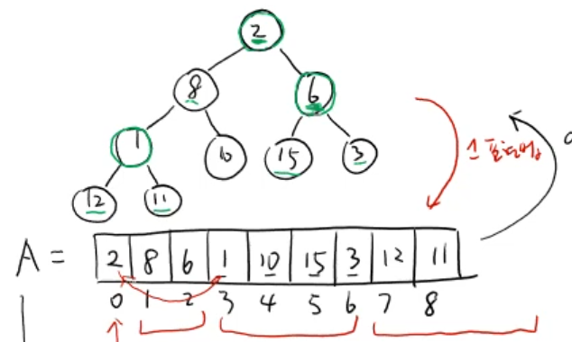
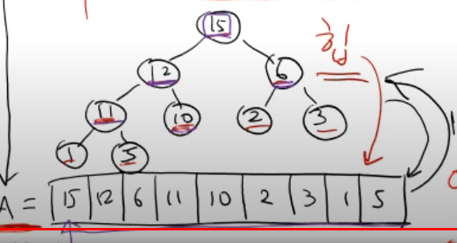

이전에 한 번 공부했었는데 다시 자료구조와 알고리즘 공부하려고

가물가물한 부분부터 다시 시작해보려고 한다.

> 출처
> https://www.youtube.com/watch?v=8XnPN6IB22Y&list=PLsMufJgu5933ZkBCHS7bQTx0bncjwi4PK&index=21

# 이진트리

---

### 배열로 표현하는 이진트리

이진 트리는 배열로 표현 가능하다.



이 때 비어있는 노드는 `Null` 로 표현 가능 할 때 배열의 길이는 이진트리의 레벨을 `l` 로 뒀을 때

`2**l - 1` 이다.

배열의 인덱스를 `K` 라고 뒀을 때 `K`번째 노드의 자식 노드는 `2K + 1 ,2K  + 2` 로 표현 가능하다.

그렇다면 자식 노드를 `C` , 부모 노드를 `P` 라고 뒀을 때

`C` 는 `2P + 1 , 2P + 2` 로 표현 가능하기에 반대로

`P` 는 `(C - 1) // 2` 로 표현 가능하다.

이를 통해 이진 트리에서는 부모노드와 자식노드를 `O(1)` 만에 찾는 것이 가능하다.

# 힙

---



힙은 특별한 성질을 만족하는 이진 트리를 일컫는다. 이러한 성질을 힙성질이라 하며

힙 성질은 다음과 같다.

1. 힙은 이진트리의 특성을 갖는다.
2. 부모 노드는 자식 노드보다 무조건 크거나 같다.

결국 힙은 루트 노드에 존재하는 값이 가장 크고 , 높은 레벨일 수록 값이 높다.

이러한 특징으로 힙은 힙 성질을 만족하기 위해 특정 값을 삽입하거나 , 제거하는 경우

힙 성질을 만족하기 위한 **힙 정렬** 이 반복된다.

이런 **힙 정렬** 의 시간 복잡도는 `log n` 이다.

> 추후 힙 정렬에 대해 공부하도록 한다.

힙에서 가능한 연산들의 시간 복잡도는 다음과 같다.

- 최대값 찾기 : `O(1)` [단순히 가장 0 번째 값만 빼면 된다. [큐 자료구조를 만족 할 때]]
- 값 넣기, 제거 : `O(log n)` - 값을 `O(1)` 만에 뺀 후 힙정렬을 하여야 한다.

## 힙 코드로 구현하기

---

```jsx
class Heap {
  constructor(array) {
    this.arr = array;
    this.length = array.length;
    this.makeHeap();
  }

  heapifyDown(k, n = this.length - 1) {
    while (k * 2 + 1 <= n) {
      /*
      k 노드와 L ,R  자식 노드와의 값을 비교하고 
      부모 자식 중 가장 큰 값의 인덱스를 m 에 저장  
      */
      const [L, R] = [k * 2 + 1, k * 2 + 2]; // 자식 노드들의 인덱스
      let m = k;
      if (this.arr[L] > this.arr[k]) {
        m = L;
      }
      if (R <= n && this.arr[R] > this.arr[m]) {
        m = R;
      }
      /*
      만약 k 가 자식 노드보다 값이 작다면 
      해당 자식노드와 위치를 바꾸고  바꾼 위치에서 반복문 재실행
      */
      if (m != k) {
        [this.arr[m], this.arr[k]] = [this.arr[k], this.arr[m]];
        k = m;
      } else {
        break;
      }
    }
  }

  makeHeap() {
    for (
      let index = Math.floor((this.length - 1) / 2);
      index >= 0;
      index -= 1
    ) {
      this.heapifyDown(index);
    }
  }
}
```

```js
const arr = [2, 8, 6, 1, 10, 15, 3, 12, 11];
const heap = new Heap(arr);
console.log(heap.arr);
```

```json
[9, 8, 7, 4, 5, 6, 3, 2, 1] // 힙
```

힙을 만드는 방법은 매우 단순하다. 임의의 배열 (힙 성질을 만족하지 않는 이진 트리) 을 받았을 때

해당 이진 트리의 `left node` (마지막 인덱스)부터 `root node` 까지 역행하면서 `heapify-down` 을 해주면 된다.

이 때 `heapify-down` 이란 부모노드가 자식 노드보다 값이 큰 힙 성질을 만족하는지 확인하고

만족하지 않는다면 만족 할 때 까지 해당 부모 노드를 `leaf node` 방향으로 내리는 행위를 말한다.

위 코드를 살펴보면 기준이 되는 인덱스 `m` 을 기준으로 하여 비교하며 , `k` 가 `m` 과 다르다면 값을 변경하고 변경된 위치에서 반복문을 실행하는 모습을 볼 수 있다.

### `makeHeap` 의 시간 복잡도

---

배열의 길이가 `n` 이라 했을 때

`n` 개의 원소를 역행하면서 `O(N)` , 역행 할 때 마다 `heapify-down` 을 실행하니

`heapify-down` 의 시간 복잡도를 `O(t)` 라고 한다면

전체 시간 복잡도는 `O(N  * t)` 이다.

`O(t)` 를 구해보자

`heapify-down` 내부 반복문은 모두 인덱스로 배열에 접근하는 것이기 때문에 `O(1)` 만에 가능하다.

다만 몇 번이나 `heapify-down` 내부 반복문이 실행되는가가 관건인데

가장 최악의 경우는 `root` 의 값이 가장 작아 `leaf node` 까지 가야하는 경우일 것이다.

이 때 `root` 부터 `leaf` 까지의 길이는 최대 `log  n` 을 넘지 않으니

`heapify-down` 의 시간 복잡도는 `log n` 이다.

이에 `meakHeap` 의 시간 복잡도는 `O(n * log n)` 이다.

## `insert`

새로운 값이 들어올 떄에는 가장 `leaf node` 에 새로운 값을 추가 한 후

추가된 값을 기준으로 힙 성질을 만족하도록 `heapify-up` 을 시켜주면 된다.

```js
  heapifyUp(k) {
    while (k > 0) {
      const p = Math.floor((k - 1) / 2); // 부모 노드의 인덱스
      if (this.arr[k] > this.arr[p]) {
        [this.arr[k], this.arr[p]] = [this.arr[p], this.arr[k]];
        k = p;
      } else {
        break;
      }
    }
  }

  insert(value) {
    this.arr.push(value);
    this.length += 1;
    this.heapifyUp(this.length - 1);
  }
```

`insert` 의 경우엔 배열에 값을 추가해주고 길이를 늘린 후 `heapifyUp` 메소드를 호출한다.

`heapfyUp` 메소드는 `leaf node` 부터 `root node` 까지 순회하는 반복문을 통해

부모노드와 자식 노드의 값을 비교하여 자식노드가 값이 더 크다면

자식노드와 부모노드의 값을 변경하고 부모노드에 위치한 자식 노드로부터 다시 반복문을 순회한다.

이 때 다른 트리들은 이미 힙 성질을 만족하고 있기 때문에 다른 서브 트리들을 건드릴 필요가 없다.

```js
const arr = [2, 8, 6, 1, 10, 15, 3, 12, 11];
const heap = new Heap(arr);
console.log(heap.arr);
heap.insert(20);
console.log(heap.arr);
```

```json
[15, 12, 6, 11, 10, 2, 3, 1, 8] // insert 전
[20, 15, 6, 11, 12, 2,  3, 1,  8, 10] // insert 후
```

### `insert` 의 시간 복잡도

배열에 값을 추가하는 행위는 `O(1)` ,

`heapify-up` 의 시간 복잡도는 최악의 경우 `leaf node` 부터 `root node` 까지 변경되어야 하니

`O(log n)` 이기에 시간 복잡도는 `O(log n)` 이다.

## `findMax , DeleteMax`

힙에서 최대값을 찾는 함수는 그저 단순히 힙의 `root` 노드를 반환하면 된다.

그렇다면 최대 값을 찾아 제거하는 함수는 어떻게 진행될까 ?

```jsx
  findMax() {
    return this.arr[0];
  }

  deleteMax() {
    const maxValue = this.arr[0]; // 반환할 값을 캐싱
    /* root node , leaf node  값 스왑 */
    [this.arr[0], this.arr[this.length - 1]] = [
      this.arr[this.length - 1],
      this.arr[0],
    ];
    /* leaf node 값 (이전 root node) 제거*/
    this.arr.pop();
    this.length -= 1;
    /* root node 부터 heapify-down */
    this.heapifyDown(0);
    return maxValue;
  }
```

`deleteMax` 는 가장 최대 값을 배열에서 제거하고 반환하기 위해 저장해둔다.

이후 가장 `leaf node` 에 존재하는 값을 `root node` 로 이동시킨 후

`root node` 부터 `heapifyDown` 을 시행후 저장해둔 최대값을 반환한다.

이 때의 시간 복잡도는 `O(log n)` 이다.

> 가장 최악은 `root node` 부터 다시 `leaf node` 까지 내려가는 것이다.

---

이번에 설명한 힙은 `Max heap` 에 대한 이야기인데 , 만일 부등호 방향만 다르게 한다면 `Min heap` 도 쉽게 만들 수 있다.

이처럼 `heap` 은 숫자 대소에 따라 값을 정렬하고 싶을 때 적합한 자료구조이다.
